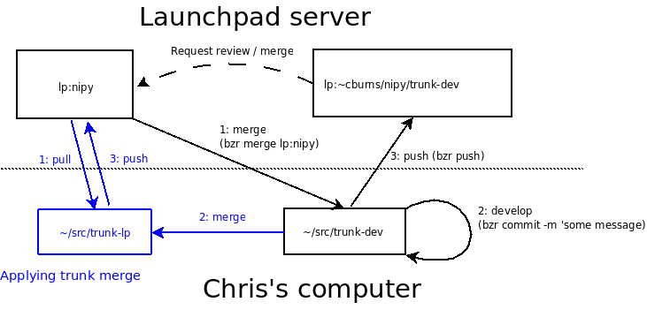

.. _bzr_administration:

============================
 nipy bazaar administration
============================

.. Contents::

Submit reviewed code
--------------------

The administrator (at the moment, this is Chris Burns), will merge changes into
the trunk, from development branches.  The diagram shows the *administrator*
workflow:

The process looks something like this on the command line::

 cd trunk-lp
 bzr pull lp:nipy
 bzr merge ../trunk-dev
 bzr ci --author="user name"
 # enter detailed commit message in a docstring format
 bzr push lp:nipy

Please don't do this yourself; even the core members of the
development team will leave this process to the administrator.

Example: Merging Fernando's Matplotlib Sphinx docs
--------------------------------------------------

One of the first test cases of the trunk-lp/trunk-dev branch strategy
was merging the matplotlib_ documentation skeleton, which uses sphinx_
into the nipy-trunk.  The summary of the process:

#. Pull the nipy trunk and confirm your main trunk is current.
#. Download Fernando's branch.
#. Build and test Fernando's branch.
#. Merge Fernando's trunk into the main trunk.
#. Build and test main trunk after the merge.
#. Commit merge and push to launchpad

Matthew Brett performed this merge on his machine.

::

    # Change to nipy source repository
    cd ~/dev_trees/nipy-repo

    # Update main trunk
    cd lp-trunk/
    bzr pull

    # Download Fernando branch
    bzr branch lp:~fperez/nipy/trunk-dev fp-trunk-dev
    cd ..

    # Build and test.  # FIXME: Need a good system for doing this
    #python setup.py build
    #python setup.py install
    #python -c "import nipy as ni; ni.test()"

    # Merge Fernando branch
    bzr log -r last:
    bzr merge ../fp-trunk
    bzr commit

    # Push up to launchpad
    bzr push bzr+ssh://matthew-brett@bazaar.launchpad.net/~nipy-developers/nipy/trunk --remember

.. include:: ../../links_names.txt

