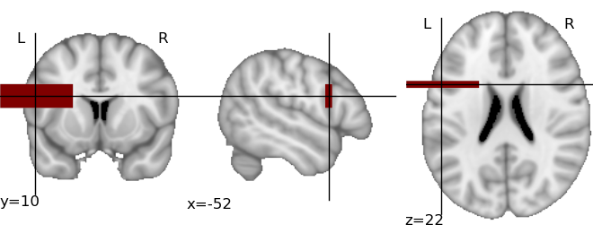

Plotting of activation maps
===========================

.. currentmodule:: nipy.labs.viz_tools.activation_maps

The module :mod:`nipy.labs.viz` provides functions to plot
visualization of activation maps in a non-interactive way.

2D cuts of an activation map can be plotted and superimposed on an
anatomical map using matplotlib_. In addition, Mayavi2_ can be used to
plot 3D maps, using volumetric rendering. Some emphasis is made on
automatic choice of default parameters, such as cut coordinates, to give
a sensible view of a map in a purely automatic way, for instance to save
a summary of the output of a calculation.

.. _matplotlib: http://matplotlib.sourceforge.net

.. _Mayavi2: http://code.enthought.com/projects/mayavi

.. warning::

    The content of the module will change over time, as neuroimaging
    volumetric data structures are used instead of plain numpy arrays.

An example
----------

::

    from nipy.labs.viz import plot_map, mni_sform, coord_transform

    # First, create a fake activation map: a 3D image in MNI space with
    # a large rectangle of activation around Broca Area
    import numpy as np
    mni_sform_inv = np.linalg.inv(mni_sform)
    # Color an asymmetric rectangle around Broca area:
    x, y, z = -52, 10, 22
    x_map, y_map, z_map = coord_transform(x, y, z, mni_sform_inv)
    map = np.zeros((182, 218, 182))
    map[x_map-30:x_map+30, y_map-3:y_map+3, z_map-10:z_map+10] = 1

    # We use a masked array to add transparency to the parts that we are
    # not interested in:
    thresholded_map = np.ma.masked_less(map, 0.5)

    # And now, visualize it:
    plot_map(thresholded_map, mni_sform, cut_coords=(x, y, z), vmin=0.5)

This creates the following image:

The same plot can be obtained fully automatically, by letting
:func:`plot_map` find the activation threshold and the cut coordinates::

    plot_map(map, mni_sform, threshold='auto')

In this simple example, the code will easily detect the bar as activation
and position the cut at the center of the bar.

`nipy.labs.viz` functions
-------------------------

.. autosummary::
    :toctree: generated

    plot_map

3D plotting utilities
---------------------

.. currentmodule:: nipy.labs.viz_tools.maps_3d

The module :mod:`nipy.labs.viz3d` can be used as helpers to
represent neuroimaging volumes with Mayavi2_.

.. autosummary::
    :toctree: generated

    plot_map_3d
    plot_anat_3d

For more versatile visualizations the core idea is that given a 3D map
and an affine, the data is exposed in Mayavi as a volumetric source, with
world space coordinates corresponding to figure coordinates.
Visualization modules can be applied on this data source as explained in
the `Mayavi manual
<http://code.enthought.com/projects/mayavi/docs/development/html/mayavi/mlab.html#assembling-pipelines-with-mlab>`_

.. autosummary::
    :toctree: generated

    affine_img_src

