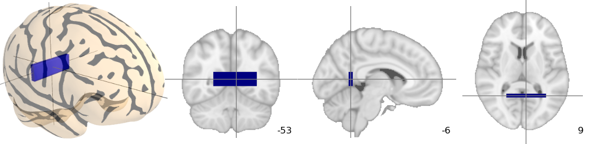

Automatic plotting of activation maps
=====================================

.. currentmodule:: fff2.viz.activation_maps

The module :mod:`fff2.viz.activation_maps` provides functions to plot
visualization of activation maps in a non-interactive way.

2D cuts of an activation map can be plotted and superimposed on an
anatomical map using matplotlib_. In addition, Mayavi2_ can be used to
plot 3D maps, using volumetric rendering. Some emphasis is made on
automatic choice of default parameters, such as cut coordinates, to give
a sensible view of a map in a purely automatic way, for instance to save
a summary of the output of a calculation.

.. _matplotlib: http://matplotlib.sourceforge.net

.. _Mayavi2: http://code.enthought.com/projects/mayavi

An example
-----------

::

    from fff2.viz.activation_maps import plot_map, mni_sform, \
            coord_transform

    # First, create a fake activation map: a 3D image in MNI space with
    # a large rectangle of activation around Brodmann Area 26
    import numpy as np
    mni_sform_inv = np.linalg.inv(mni_sform)
    map = np.zeros((182, 218, 182))
    x, y, z = -6, -53, 9
    x_map, y_map, z_map = coord_transform(x, y, z, mni_sform_inv)
    map[x_map-30:x_map+30, y_map-3:y_map+3, z_map-10:z_map+10] = 1
    
    # And now, visualize it:
    plot_map(map, mni_sform, cut_coords=(x, y, z), vmin=0.5)

This creates the following image:

The same plot can be obtained fully automaticaly, by using
:func:`auto_plot_map` to find the activation threshold `vmin` and the cut
coordinnates::

    from fff2.viz.activation_maps import auto_plot_map
    auto_plot_map(map, mni_sform)

In this simple example, the code will easily detect the bar as activation
and position the cut at the center of the bar.

fff2.viz.activation_maps functions
-----------------------------------

.. autosummary::
    :toctree: generated

    coord_transform
    find_activation
    find_cut_coords
    plot_map_2d
    plot_map_3d
    auto_plot_map
    plot_niftifile

The plot_activation script
---------------------------

In addition to the above functions, callable from Python, there is also
script :program:`plot_activation` that can be used to easily render
previews from Nifti files. It can also optionally output an html file, to
summarize many maps on one screen.

In its simplest use, it is called like this::

    plot_activation file1.nii file2.nii [...]

The :program:`plot_activation` script has several many options:

**-h**, **--help**            
    show the help message and exit

**-o** *DIR*, **--outdir=DIR**
    write all output to DIR

**-f** *FILE*, **--htmlfile=FILE**
    write report to a html file FILE, useful when visualizing multiple files

**-a** *FILE*, **--anat=FILE**
    use the given Nifti file as an anatomy

**-M** *FILE*, **--mask=FILE**  
    use the given Nifti file as a mask

**-d**, **--no3d**
    don't try to do a 3D view

**-s**, **--sign**  
    force activation sign to be positive

**-c** *CUT_COORDS*, **--cut-coords=CUT_COORDS**
    Talairach coordinates of the 2D cuts

**-m** *VMIN*, **--vmin=VMIN**
    Minimum value for the activation, used for thresholding

