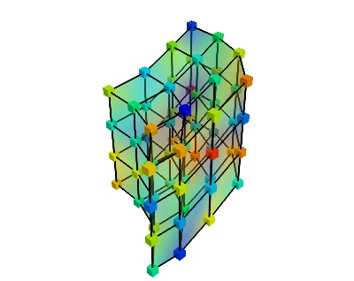

=============================
Volumetrique data structures
=============================

.. currentmodule:: nipy.datasets.volumes.volume_img

The image structure: `VolumeImg`
==================================

The structure most often used in neuroimaging is the
:class:`VolumeImg`. It corresponds to the structure used in the Nifti
files.

We call a volume-image (`VolumeImg`) a volumetric datastructure given by
data points lying on a regular grid: this structure is a generalization
of an image in 3D. The voxels, vertices of the grid, are mapped to
coordinnate by an affine transformation. As a results, the grid is
regular and evenly-spaced, but may not be orthogonal, and the spacing ma
differ in the 3 directions.

.. image:: datasets/volume_img.jpg

Class :class:`VolumeImg`: methods and attributes
--------------------------------------------------

.. autoclass:: VolumeImg
  :members:
  :undoc-members:
  :show-inheritance:
  :inherited-members:

  .. automethod:: __init__

More general data structures
===============================

:class:`VolumeGrid`
----------------------

.. autoclass:: VolumeGrid
  :members:
  :undoc-members:
  :show-inheritance:
  :inherited-members:

  .. automethod:: __init__

Creating your own structures
==================================

