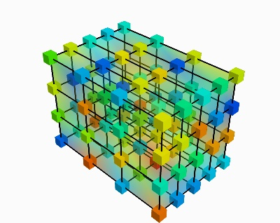

=============================
Volumetrique data structures
=============================

.. currentmodule:: nipy.datasets.volumes.volume_img

The image structure: `VolumeImg`
==================================

:class:`VolumeImg`
------------------

.. autoclass:: VolumeImg
  :members:
  :undoc-members:
  :show-inheritance:
  :inherited-members:

  .. automethod:: __init__

Creating your own structures
==================================

